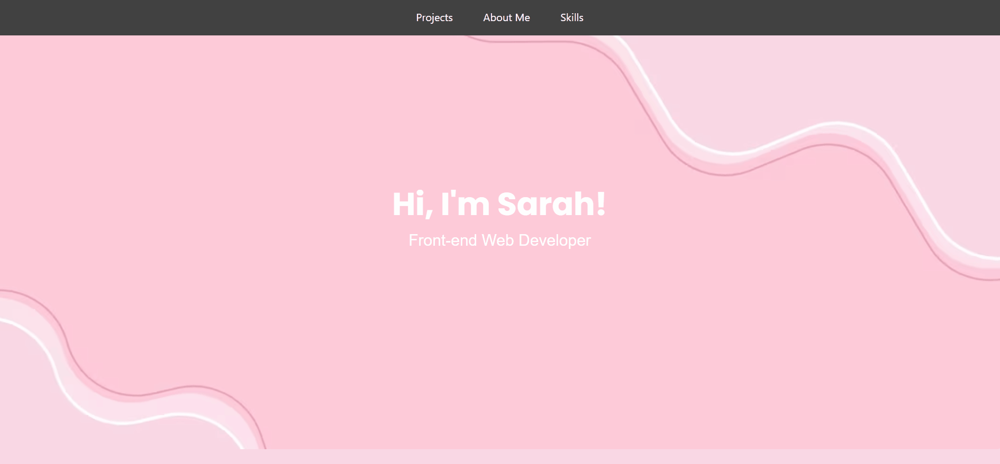

# Bootstrap Portfolio

## Description
I created this portfolio webpage using Bootstrap aswell as my own skills with HTML and CSS in order to show an upgrade in knowledge from my previous portfolio made without Bootstrap and also to document my projects throughout my web development journey. 

## Usage
The deployed portfolio can be accessed via [here](https://skechekar.github.io/bootstrap-portfolio) hosted on GitHub Pages. Links in the navigation bar will direct you to their respective section on the page when clicked. Hovering over the project placeholder images will trigger the box shadow glow. Clicking on contact info icons in the footer will direct you to their respective destinations (e.g. clicking on the mail icon will open your mail app).

## Credits

[Flaticon](https://www.flaticon.com/free-icons/rainbow) for the favicon.

## License

Please refer to the license in the repo.